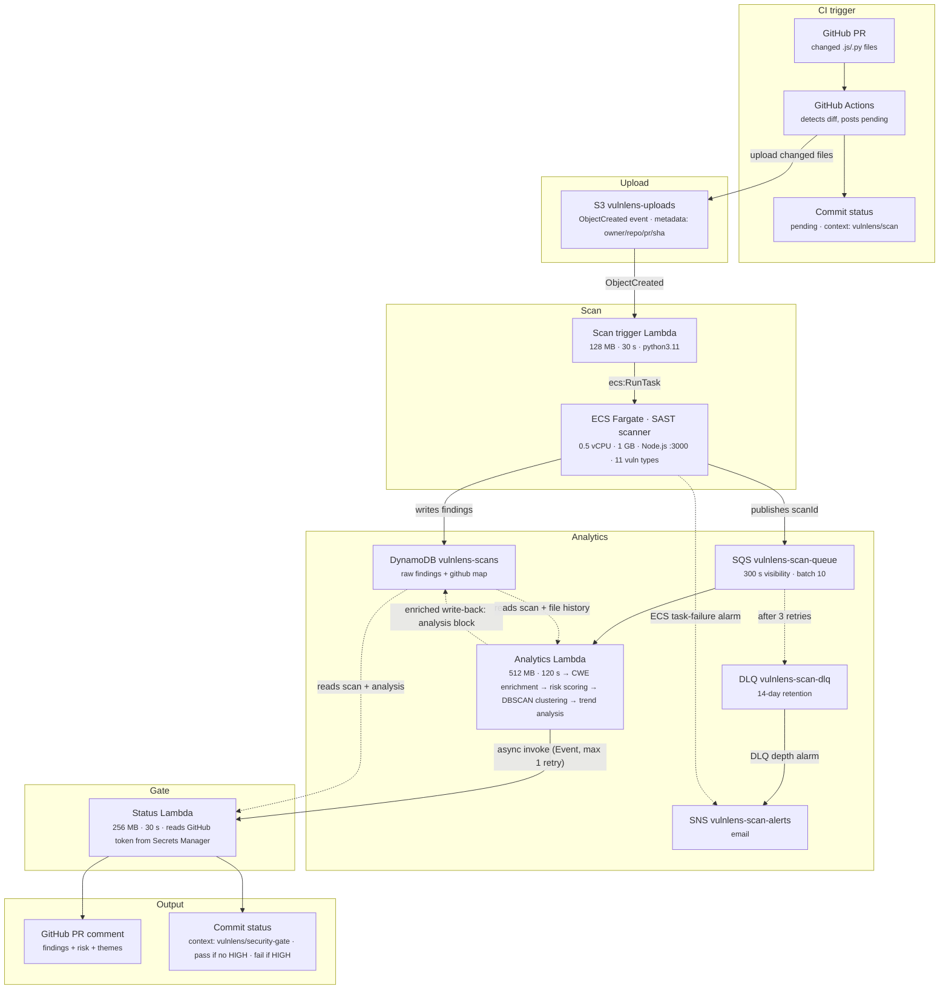

# VulnLens — Pipeline Architecture

End-to-end flow, generated from the Terraform IaC and handler code.

```mermaid
flowchart TD
  %% ---------------- CI trigger ----------------
  subgraph CI["CI trigger"]
    PR["GitHub PR<br/><small>changed .js/.py files</small>"]
    GHA["GitHub Actions<br/><small>detects diff, posts pending</small>"]
    CS1["Commit status<br/><small>pending · context: vulnlens/scan</small>"]
    PR --> GHA --> CS1
  end

  %% ---------------- Upload ----------------
  subgraph UP["Upload"]
    S3["S3 vulnlens-uploads<br/><small>ObjectCreated event · metadata: owner/repo/pr/sha</small>"]
  end
  GHA -->|"upload changed files"| S3

  %% ---------------- Scan ----------------
  subgraph SCAN["Scan"]
    TRIG["Scan trigger Lambda<br/><small>128 MB · 30 s · python3.11</small>"]
    ECS["ECS Fargate · SAST scanner<br/><small>0.5 vCPU · 1 GB · Node.js :3000 · 11 vuln types</small>"]
  end
  S3 -->|"ObjectCreated"| TRIG
  TRIG -->|"ecs:RunTask"| ECS

  %% ---------------- Analytics ----------------
  subgraph AN["Analytics"]
    DDB["DynamoDB vulnlens-scans<br/><small>raw findings + github map</small>"]
    SQS["SQS vulnlens-scan-queue<br/><small>300 s visibility · batch 10</small>"]
    ALAM["Analytics Lambda<br/><small>512 MB · 120 s → CWE enrichment → risk scoring → DBSCAN clustering → trend analysis</small>"]
    DLQ["DLQ vulnlens-scan-dlq<br/><small>14-day retention</small>"]
    SNS["SNS vulnlens-scan-alerts<br/><small>email</small>"]
  end

  ECS -->|"writes findings"| DDB
  ECS -->|"publishes scanId"| SQS
  SQS --> ALAM
  DDB -.->|"reads scan + file history"| ALAM
  ALAM -.->|"enriched write-back: analysis block"| DDB
  SQS -.->|"after 3 retries"| DLQ
  DLQ -->|"DLQ depth alarm"| SNS
  ECS -.->|"ECS task-failure alarm"| SNS

  %% ---------------- Gate ----------------
  subgraph GATE["Gate"]
    STAT["Status Lambda<br/><small>256 MB · 30 s · reads GitHub token from Secrets Manager</small>"]
  end
  ALAM -->|"async invoke (Event, max 1 retry)"| STAT
  DDB -.->|"reads scan + analysis"| STAT

  %% ---------------- Output ----------------
  subgraph OUT["Output"]
    PRC["GitHub PR comment<br/><small>findings + risk + themes</small>"]
    CS2["Commit status<br/><small>context: vulnlens/security-gate · pass if no HIGH · fail if HIGH</small>"]
  end
  STAT --> PRC
  STAT --> CS2
```